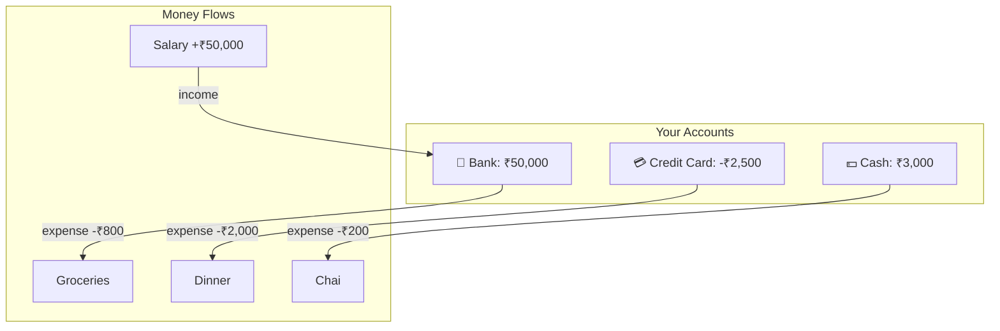

# Money Flow

This page explains the conceptual model behind how money moves in Lyari.

## Accounts as Pots

Each account (bank, credit card, wallet, cash) is a **pot** with a balance. The balance is a single integer (stored as cents) that represents how much money is in that pot right now.


## Income Increases Balance

When you record income and assign it to an account, the account's balance goes **up**:

```
account.balance += income.amount
```

Example: You earn ₹50,000 salary deposited into "HDFC Savings". The account balance increases by 50,000,00 cents (₹50,000).

## Expenses Decrease Balance

When you add an expense and select a "Pay from" account, the account's balance goes **down**:

```
account.balance -= expense.amount
```

Example: You buy groceries for ₹800 paid from "HDFC Savings". The balance decreases by 800,00 cents (₹800).

## Credit Cards Go Negative

Credit card accounts start at zero (or whatever starting balance you set). Every expense paid from a credit card **decreases** the balance further, making it negative. This represents money you owe.

```
Credit Card balance: 0
  Pay ₹2,000 for dinner → balance: -₹2,000
  Pay ₹500 for coffee  → balance: -₹2,500
```

To "pay off" a credit card, record an income entry deposited into the credit card account, which brings the balance back toward zero.

## No Automatic Bank Feeds

Lyari does **not** connect to banks or payment providers. There are no automatic imports, no Plaid integration, no transaction syncing. Every entry -- income, expense, account -- is entered manually by the user.

This is by design: the app is a personal bookkeeping tool, not a bank aggregator.

## No Automatic Transfers

There is no "transfer between accounts" feature. If you move money from one account to another in real life, you can model it as:

1. An **income** deposit into the destination account, or
2. A manual balance adjustment

The app does not enforce double-entry accounting.

## Summary

| Action | Effect on Account Balance |
|--------|--------------------------|
| Record income → deposit into account | Balance **increases** |
| Add expense → pay from account | Balance **decreases** |
| Credit card expense | Balance goes **more negative** |
| Pay off credit card (income deposit) | Balance moves **toward zero** |



All of this is manual entry. Lyari trusts the user to be the source of truth for their own finances.
