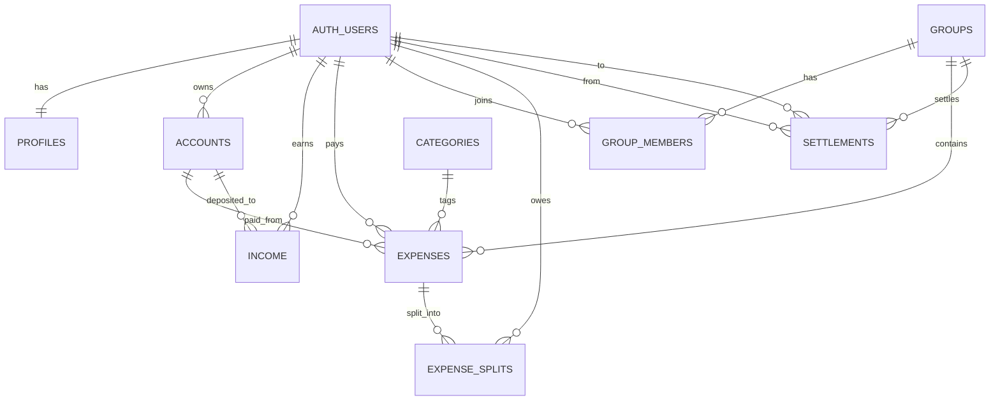

# Database Schema

All monetary amounts are stored as **integer cents** to avoid floating-point errors.

## ER Diagram

## Tables

### profiles

Extends `auth.users` with app-specific data.

| Column | Type | Notes |
|--------|------|-------|
| `id` | UUID (PK) | References `auth.users` |
| `full_name` | TEXT | |
| `avatar_url` | TEXT | |
| `email` | TEXT | Copied from `auth.users` on signup |
| `default_currency` | TEXT | Default `'USD'` |
| `created_at` | TIMESTAMPTZ | |
| `updated_at` | TIMESTAMPTZ | |

### categories

Seeded lookup table for expense categorization.

| Column | Type | Notes |
|--------|------|-------|
| `id` | UUID (PK) | |
| `name` | TEXT (UNIQUE) | e.g. "Groceries" |
| `icon` | TEXT | Material icon name |
| `color` | TEXT | Hex color |

### accounts

Financial accounts for tracking money sources.

| Column | Type | Notes |
|--------|------|-------|
| `id` | UUID (PK) | |
| `user_id` | UUID (FK) | Owner |
| `name` | TEXT | e.g. "Chase Checking" |
| `type` | `account_type` ENUM | bank, credit_card, debit_card, wallet, cash, other |
| `balance` | INTEGER | Cents |
| `currency` | TEXT | Default `'USD'` |
| `icon` | TEXT | Optional |
| `color` | TEXT | Hex color |
| `is_default` | BOOLEAN | |

### income

Records of money earned / deposited.

| Column | Type | Notes |
|--------|------|-------|
| `id` | UUID (PK) | |
| `user_id` | UUID (FK) | |
| `account_id` | UUID (FK, nullable) | Which account it goes into |
| `amount` | INTEGER | Cents |
| `currency` | TEXT | Default `'USD'`; inherits from linked account |
| `source` | TEXT | e.g. "Salary" |
| `date` | DATE | |
| `notes` | TEXT | |

### groups

| Column | Type | Notes |
|--------|------|-------|
| `id` | UUID (PK) | |
| `name` | TEXT | |
| `type` | `group_type` ENUM | trip, home, custom |
| `currency` | TEXT | Default `'USD'`; group ledger currency |
| `created_by` | UUID (FK) | |

### group_members

| Column | Type | Notes |
|--------|------|-------|
| `id` | UUID (PK) | |
| `group_id` | UUID (FK) | |
| `user_id` | UUID (FK) | |
| `role` | `group_role` ENUM | admin, member |
| `joined_at` | TIMESTAMPTZ | |

### expenses

| Column | Type | Notes |
|--------|------|-------|
| `id` | UUID (PK) | |
| `title` | TEXT | |
| `amount` | INTEGER | Cents, CHECK > 0 |
| `currency` | TEXT | |
| `category_id` | UUID (FK, nullable) | |
| `date` | DATE | |
| `payer_id` | UUID (FK) | Who paid |
| `group_id` | UUID (FK, nullable) | NULL = personal expense |
| `account_id` | UUID (FK, nullable) | Which account was used |
| `notes` | TEXT | |

### expense_splits

| Column | Type | Notes |
|--------|------|-------|
| `id` | UUID (PK) | |
| `expense_id` | UUID (FK) | |
| `user_id` | UUID (FK) | Who owes |
| `owed_amount` | INTEGER | Cents |
| `split_type` | `split_type` ENUM | equal, exact, percentage |

### settlements

| Column | Type | Notes |
|--------|------|-------|
| `id` | UUID (PK) | |
| `from_user_id` | UUID (FK) | |
| `to_user_id` | UUID (FK) | |
| `amount` | INTEGER | Cents |
| `currency` | TEXT | Default `'USD'`; matches group currency |
| `group_id` | UUID (FK) | |
| `status` | `settlement_status` ENUM | pending, completed |
| `settled_at` | TIMESTAMPTZ | |

## Migration 00003: Currency Columns

`supabase/migrations/00003_currency_columns.sql` adds `currency TEXT NOT NULL DEFAULT 'USD'` to the `groups`, `settlements`, and `income` tables. Existing rows are backfilled:

- **settlements**: currency set from the related group's currency
- **income**: currency set from the linked account's currency (rows with no linked account keep the `'USD'` default)
