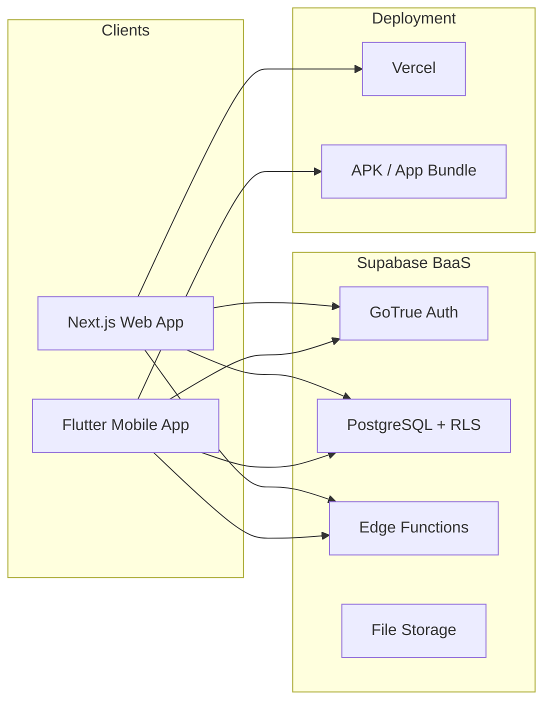

# The Ledger

**The Ledger** (codename *Lyari*) is a comprehensive financial platform combining personal expense tracking with Splitwise-style group expense sharing. Built on a serverless BaaS architecture with zero hosting costs.

## Architecture



## Tech Stack

| Layer | Technology |
|-------|-----------|
| Database & Auth | Supabase (PostgreSQL, GoTrue, RLS) |
| Web Dashboard | Next.js 14, React, Tailwind CSS, Recharts |
| Mobile App | Flutter (Material 3), Riverpod, go_router |
| Edge Functions | Deno (TypeScript) -- Debt Simplifier |
| Deployment | Vercel (web), local APK build (mobile) |

## Key Features

- **Personal Expense Tracking** -- filterable data table, category budgets
- **Accounts Ledger** -- bank accounts, credit/debit cards, wallets (GPay, PayPal, cash)
- **Income Tracking** -- record earnings deposited into accounts
- **Group Expense Sharing** -- equal/exact/percentage splits
- **Debt Simplification** -- min cash flow algorithm via Edge Function
- **Analytics** -- category pie charts, burn rate trends, comparison charts
- **Mobile-First Add** -- fast expense entry with numpad UI

## Project Structure

```
lyari/
├── supabase/          # Database migrations, Edge Functions, seed data
│   ├── migrations/    # SQL schema files
│   ├── functions/     # Edge Functions (debt-simplifier)
│   └── seed.sql       # Default categories
├── web/               # Next.js 14 App Router dashboard
│   ├── app/           # Routes and pages
│   ├── components/    # Reusable UI components
│   └── lib/           # Utilities, types, Supabase clients
├── mobile/            # Flutter mobile companion app
│   └── lib/           # Dart source (screens, models, providers)
├── docs/              # This documentation site (Docusaurus)
└── stitch/            # Design system references
```
