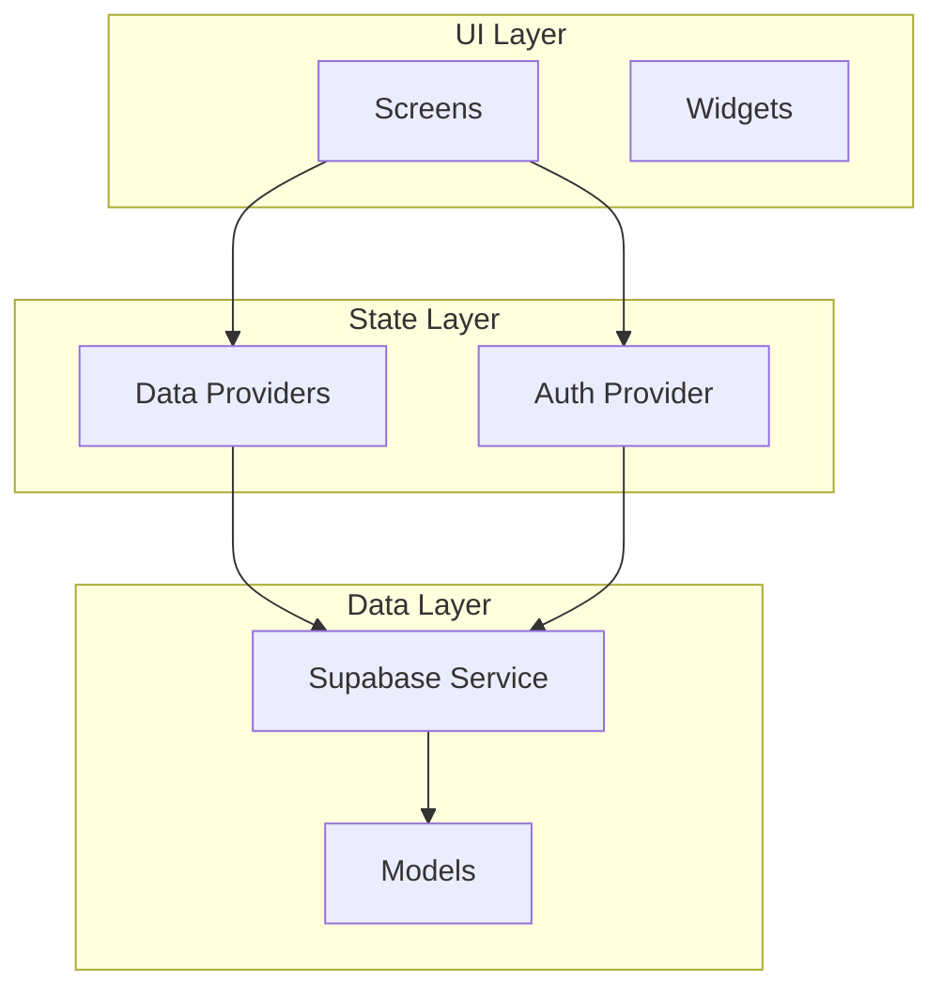

# Mobile App Overview

The Flutter mobile app is the "On-The-Go Companion" -- optimized for speed. Adding an expense should take less than 5 seconds.

## Tech Stack

- **Flutter 3.x** (Material 3)
- **Riverpod** for state management
- **go_router** for navigation
- **supabase_flutter** for auth and data
- **Google Fonts** (Manrope + Inter)

## Architecture

## Navigation

Bottom navigation with 3 tabs + a central FAB:

| Tab | Screen | Description |
|-----|--------|-------------|
| 1 | Dashboard | Summary numbers, recent transactions |
| 2 | Groups | Group list and detail views |
| FAB | Add Expense | Full-screen modal with numpad |
| 3 | Profile | Account settings, logout |
