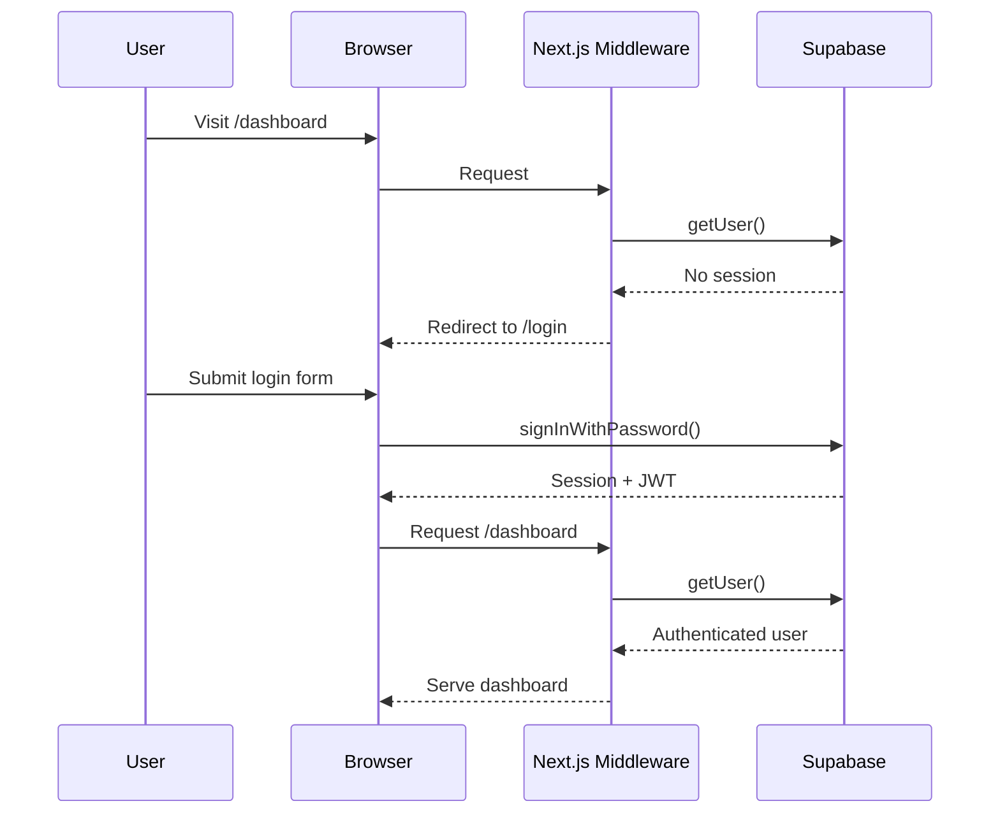

# Authentication

Authentication uses Supabase GoTrue with SSR session management.

## Flow

## Supabase Clients

| Client | File | Usage |
|--------|------|-------|
| Server | `lib/supabase/server.ts` | Server Components, Route Handlers |
| Client | `lib/supabase/client.ts` | Client Components (forms, dialogs) |
| Middleware | `lib/supabase/middleware.ts` | Session refresh on every request |

## Middleware

`web/middleware.ts` runs on every request and:

1. Refreshes the Supabase session (prevents cookie expiry)
2. Redirects unauthenticated users away from dashboard routes
3. Redirects authenticated users away from auth routes

**Public routes** that do not require authentication:

- `/` -- the marketing landing page
- `/login`
- `/register`
- `/auth/callback`

The landing page at `/` is accessible to everyone. Unauthenticated users visiting any dashboard route (e.g. `/dashboard`, `/accounts`) are redirected to `/login`. Authenticated users visiting auth routes (`/login`, `/register`) are redirected to `/dashboard`.

## OAuth Callback

`/auth/callback` handles the code exchange for Google OAuth logins, converting the authorization code into a session.
