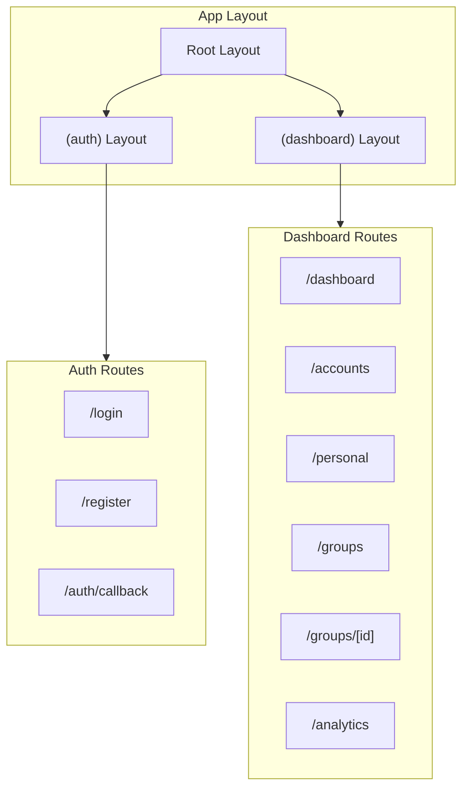

# Web App Overview

The web dashboard is the "Command Center" for detailed analytics, complex group management, and bulk entries.

## Tech Stack

- **Next.js 14** with App Router
- **React 18** with Server Components
- **Tailwind CSS** with custom design tokens
- **Shadcn-style** custom UI components (CVA-based)
- **Recharts** for analytics charts
- **Supabase SSR** for auth and data fetching
- **Lucide React** for icons

## Architecture

## Key Patterns

- **Server Components** for data fetching (no client-side fetching for initial loads)
- **Client Components** for interactive forms and dialogs
- **`loading.tsx`** files in every route group for skeleton loading states
- **`useTransition`** in sidebar for navigation progress indicators
- All monetary values stored as integer cents, formatted on display
